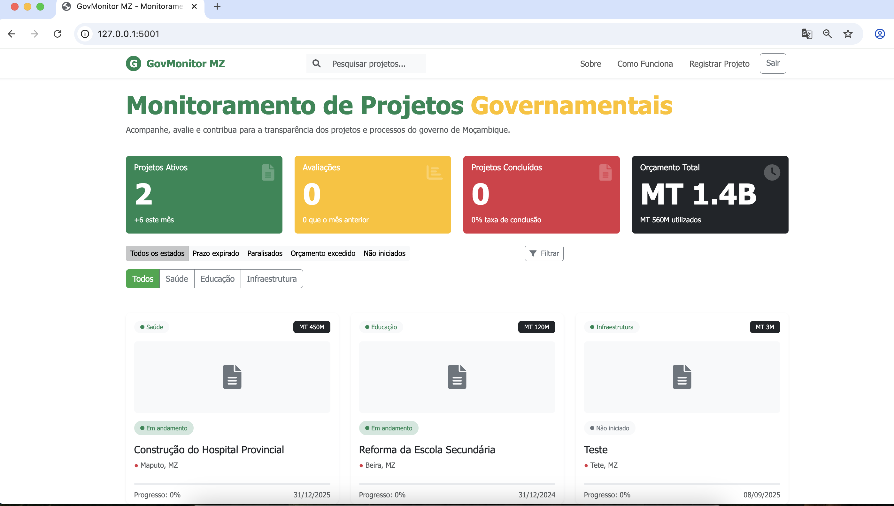

# GovMonitor MZ

Uma aplicação web para monitoramento de projetos governamentais em Moçambique, promovendo transparência e participação pública.



## Funcionalidades

- Acompanhamento de projetos governamentais em diferentes categorias e regiões
- Monitoramento do progresso, orçamentos e cronogramas dos projetos
- Avaliação e comentários dos cidadãos sobre os projetos
- Transparência nos gastos governamentais e status dos projetos

## Capturas de Telas

### Criar um projecto


### Visualizar um projecto


## Stack Tecnológica

- Python com framework Flask
- Banco de dados SQLite com SQLAlchemy ORM
- Bootstrap 5 para interface responsiva
- Sistema de autenticação para usuários e administradores

## Configuração e Instalação

1. Clone este repositório:
   ```
   git clone https://github.com/seu-usuario/govmonitor-mz.git
   cd govmonitor-mz
   ```

2. Instale as dependências:
   ```
   pip install -r requirements.txt
   ```

3. Execute a aplicação:
   ```
   python app.py
   ```

4. Acesse a aplicação em seu navegador:
   ```
   http://localhost:5001
   ```

## Usuários Padrão

A aplicação vem configurada com um usuário administrador para testes:

- Username: admin
- Senha: admin123

## Como Usar

### Para Usuários Comuns
1. Registre-se na plataforma usando a opção "Registar"
2. Faça login com suas credenciais
3. Navegue pelos projetos na página inicial ou na seção "Projetos"
4. Visualize detalhes dos projetos clicando no título ou na imagem
5. Avalie projetos através da seção "Avaliações" na página de detalhes do projeto


### Para Administradores
1. Faça login com credenciais de administrador
2. Utilize o menu "Registrar Projeto" para adicionar novos projetos
3. Preencha todos os campos obrigatórios e envie o formulário
4. Gerencie localizações utilizando o botão "+" ao lado do seletor de localização

## Estrutura do Projeto

- `app.py`: Arquivo principal da aplicação Flask
- `requirements.txt`: Dependências do projeto
- `static/`: Arquivos estáticos (CSS, JavaScript)
- `templates/`: Templates HTML
- `instance/`: Banco de dados SQLite

## Criando Capturas de Tela

Para adicionar suas próprias capturas de tela ao README:

1. Crie uma pasta `screenshots` no diretório raiz do projeto
   ```
   mkdir screenshots
   ```

2. Capture as telas da aplicação e salve-as na pasta `screenshots`

3. Atualize os caminhos das imagens neste README conforme necessário

## Licença

Este projeto está licenciado sob a Licença MIT.